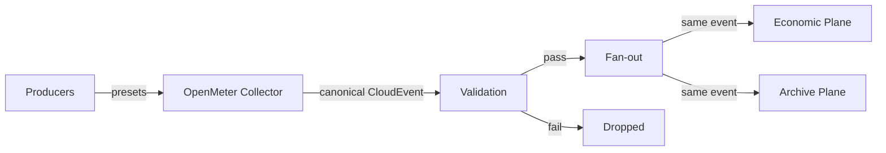
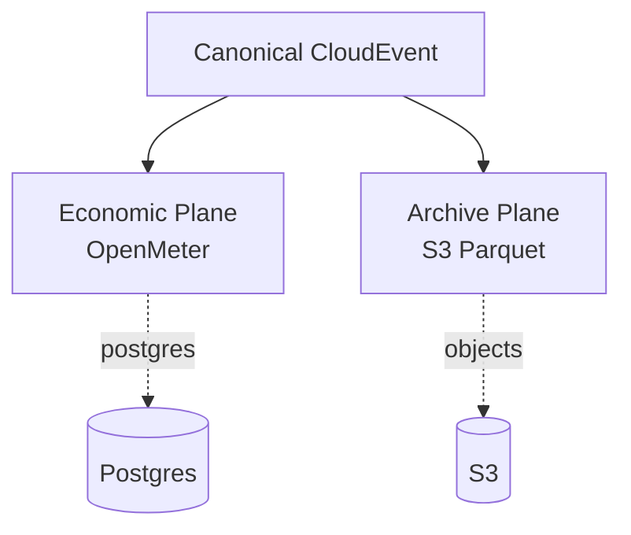

# Welkin Architecture

## What Welkin Is

Welkin is a composition-first usage substrate: it accepts heterogeneous producer events, transforms them once into canonical CloudEvents, then fans out the same canonical stream to two independent planes.

Core philosophy: **compose, don't build**. Every runtime behavior comes from an upstream system. Welkin only configures the composition.

## The Canonical Event Boundary

Welkin has one governing rule: **producer diversity is allowed only before canonicalization**. Once an event becomes a canonical CloudEvent, runtime metering and archive handling are identical regardless of producer type.

The collector boundary (`:8080/api/v1/events`) is the only valid ingestion point. Events are validated against the canonical CloudEvent contract before fan-out. Malformed events are dropped there.



## Two-Plane Design

After canonicalization, every event is routed identically to both planes. They are independent: archive failure does not block economic processing.

| Plane | Destination | Role |
|---|---|---|
| Economic | OpenMeter | Metering, billing-adjacent semantics |
| Archive | S3-compatible object storage | Parquet preservation, replay |



## Composition Map

| Component | What it is | Welkin owns | Upstream owns |
|---|---|---|---|
| OpenMeter Collector | Canonical event ingestion and fan-out | Timoni values, runtime wiring | Runtime, presets, output plugins |
| OpenMeter | Usage metering and billing semantics | Timoni values, Postgres wiring | Runtime, metering logic, Stripe integration |
| Postgres | Economic plane persistence | Timoni values, credentials | Runtime, WAL, schema |
| MinIO | Archive plane object storage | Timoni values, credentials | Runtime, durability, lifecycle |
| Flux | GitOps release reconciliation | Bundle injection | Runtime, reconciliation logic |
| Canonical CloudEvent contract | Schema definition | `spec/` CUE schemas | Validation at boundary only |

## Delegation Principle

Welkin does not own:

- **Controller logic** — delegated to Flux
- **Runtime business logic** — delegated to OpenMeter
- **Object storage runtime** — delegated to S3-compatible endpoint
- **Event collection at the edge** — delegated to OpenMeter Collector presets
- **CloudEvent validation library** — delegated to `cue vet` and schema contract

This is correct because Welkin is a **substrate**, not a platform. The governing rule prevents scope creep into areas where upstream systems are already authoritative.

### Concern → native owner

Welkin owns **no security mechanism and no runtime behavior of its own**. Every
concern maps to a native upstream owner; Welkin only configures the composition.
When evaluating any new concern, first ask: *which native system already owns
this?* If the answer requires Welkin-specific machinery, the design is wrong.

| Concern | Native owner |
|---|---|
| Action immutability | GitHub Actions policy |
| CI identity | GitHub OIDC |
| Artifact signing | Cosign / Sigstore |
| Artifact identity | OCI digest |
| Deployment | Timoni + Flux |
| Kubernetes authorization | Kubernetes RBAC |
| Network isolation | Kubernetes NetworkPolicy |
| Secret storage | Kubernetes / external-secret ecosystem |
| Secret injection | Timoni Runtime |
| HTTP TLS/auth | Redpanda Connect / upstream collector |
| Rate limiting | Redpanda Connect / Gateway ecosystem |
| Event validation | Collector + CUE contract |
| Event buffering | Collector |
| Metering | OpenMeter |
| Economic persistence | Postgres/ClickHouse as required by OpenMeter |
| Archive | S3-compatible storage |
| Reconciliation | Flux |

## Production Path

The Timoni bundle and Helm chart are **dev-only**. Upstream does not support Helm as a production deployment path for OpenMeter.

Production requires managed infrastructure:

| Component | Production requirement |
|---|---|
| Kafka | Managed Kafka (e.g. Confluent, Redpanda Cloud) — OpenMeter requires Kafka for event streaming |
| Postgres | Managed Postgres (e.g. Supabase, Neon, Cloud SQL) — not the bundled chart |
| ClickHouse | Managed ClickHouse — OpenMeter aggregates metering data here |
| S3 | Managed object storage (e.g. S3, GCS, R2) — not the bundled MinIO chart |

Welkin composes managed services via `platform/runtime/welkin.runtime.cue` Timoni injection points. Set the corresponding environment variables at apply time:

```bash
timoni bundle apply \
  -f platform/bundles/welkin-prod.bundle.cue \
  -f platform/runtime/welkin.runtime.cue \
  -f spec/meters/meters.cue \
  -f platform/collector/collector.cue \
  -f platform/economic/openmeter.cue \
  --runtime-from-env
```

The collector output and OpenMeter chart are wired to respect the runtime values. Managed Kafka, Postgres, ClickHouse, and S3 are supplied by setting their connection parameters through the same injection mechanism.

## Certification

The `certification-e2e.yml` workflow provides executable evidence for architectural guarantees:

1. Builds and pushes the release OCI artifact once, capturing its immutable digest.
2. Creates an ephemeral kind cluster and applies the Timoni bundle via `timoni bundle apply` — the same composition path as production.
3. Runs a certification Job that POSTs a canonical CloudEvent to `:8080/api/v1/events` and asserts both planes.
4. Collects evidence (scenario id, OCI digest, Job logs, cluster resources) into `/tmp/welkin-evidence/`.
5. Uploads the evidence artifact and destroys the cluster unconditionally.

Guarantees currently certified:

- One canonical CloudEvent boundary
- Malformed events rejected at the correct boundary
- Economic and archive planes remain independent
- Clean-room reproducibility through the canonical deployment path

To run certification locally:

```bash
gh workflow run certification-e2e.yml -f scenario_id=canonical-flow
```

Or select a different scenario from the certification catalog (`dist/flux/certification/`).

## Runtime Values

All `@timoni` runtime injection points in `platform/runtime/welkin.runtime.cue`:

| Injection point | Env var | Controls | Default |
|---|---|---|---|
| `runtime:namespace` | `WELKIN_NAMESPACE` | Target Kubernetes namespace | `welkin-system` |
| `runtime:openmeter:url` | `OPENMETER_URL` | OpenMeter API endpoint | `http://openmeter-api` |
| `runtime:openmeter:token` | `OPENMETER_TOKEN` | OpenMeter auth token | `changeme` |
| `runtime:postgres:host` | `POSTGRES_HOST` | Postgres host for OpenMeter | `postgres` |
| `runtime:postgres:username` | `POSTGRES_USERNAME` | Postgres username for OpenMeter | `application` |
| `runtime:postgres:password` | `POSTGRES_PASSWORD` | Postgres password for OpenMeter | `application` |
| `runtime:postgres:database` | `POSTGRES_DATABASE` | Postgres database name | `application` |
| `runtime:archive:endpoint` | `ARCHIVE_S3_ENDPOINT` | S3-compatible archive endpoint | in-cluster MinIO |
| `runtime:archive:bucket` | `ARCHIVE_S3_BUCKET` | S3 bucket for Parquet archive | `welkin-archive` |
| `runtime:archive:accessKeyId` | `ARCHIVE_S3_ACCESS_KEY_ID` | S3 access key | `minio` |
| `runtime:archive:secretAccessKey` | `ARCHIVE_S3_SECRET_ACCESS_KEY` | S3 secret key | `minio123` |

Chart versions, product semantics and defaults are pinned in `platform/product.cue` — the immutable product definition. The Runtime API (`platform/runtime/welkin.runtime.cue`) contains only environment-specific values.